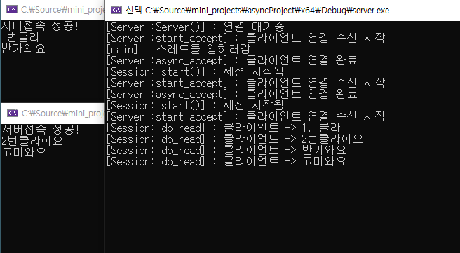
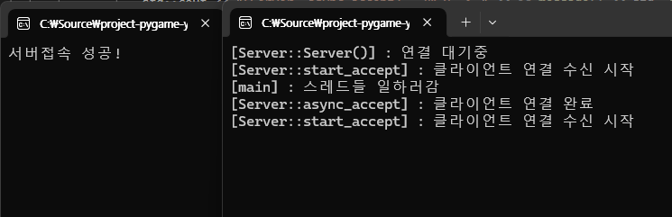

## C++ Asio(NoneBoost) 비동기 , 쓰레드 풀 활용한 서버 설계 및 구현

### 목표
- 비동기 네트워킹에 대한 깊은 이해
- 스레드풀 구조에 대한 이해와 구축 경험
- 대규모 트래픽을 염두하여 대응할 수 있는 서버 설계 및 구축

### 진행상황

- 다음 회차 목표
    - 네트워크 혼잡상황을 가정하여 send + queue 조합으로 완전한 송신을 보장하는 기능 구현하기.
    - 현재 서버측은 수신만 하고 있는 상황, 송신을 위한 구조 구현하기.
        - 일단 머리속 상상도 : 모니터 패턴 구현해보기!
            - 1. 프로듀서 : recv -> Msg Queue 푸쉬 (메시지 큐에 접근하려면 mutex lock 획득해야함) -> wait queue 에 잠자고있는 스레드에게 signal
            - 2. 컨슈머 : signal 받고 lock을 얻기 위해 entry queue 진입 -> lock 획득 후 메시지 꺼내고 빠르게 unlock 후 메시지 작업
            - 3. 가공 된 메시지를 send Queue 에 푸쉬 -> 위와 같은 방식으로 클라이언트에게 브로드캐스팅 or 송신

- 2회차 , Asio가 제공하는 async_send 메서드 활용하여 메시지 송신 해보기
    - write 와 달리 send는 네트워크 혼잡도 , 버퍼 꽉참 등으로 인해 데이터가 잘려서 보내질 수 있어 유의해서 다루어야한다.
    - send + queue 조합을 통해 안전성과, 자유도를 획득할 수 있다.
    - 고성능 서버로 갈 수록 익혀놓아야 할 스킬인 것 같다.

- 1회차 , 스레드 풀 기초구조 설계, 비동기 Acceptor 기능 구현으로 클라이언트와 연결 테스트

