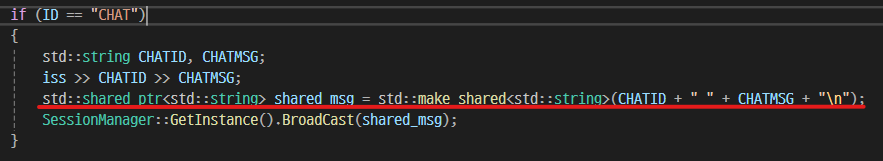
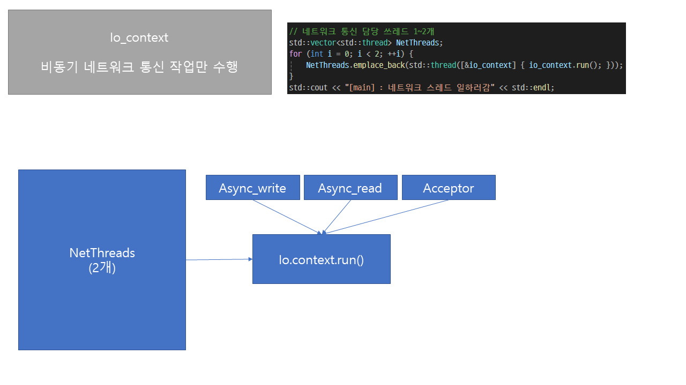
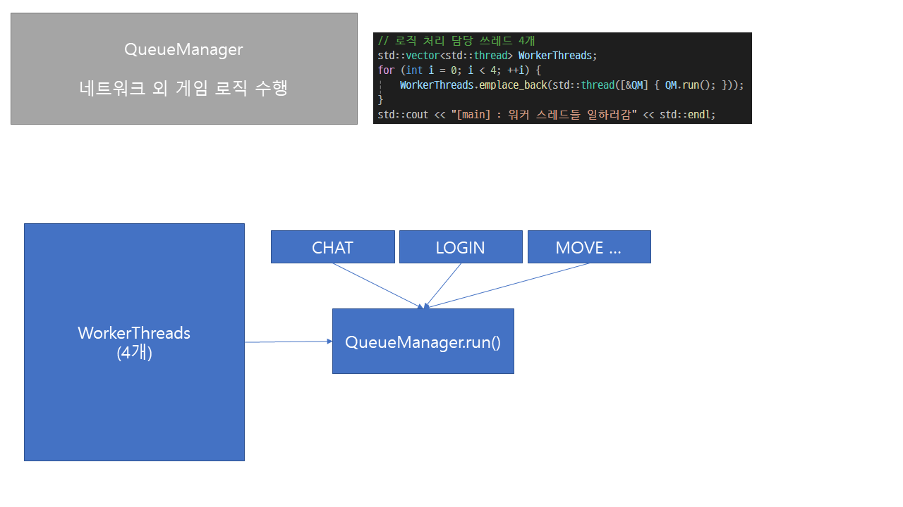
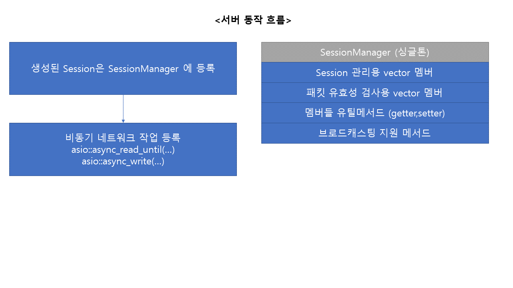
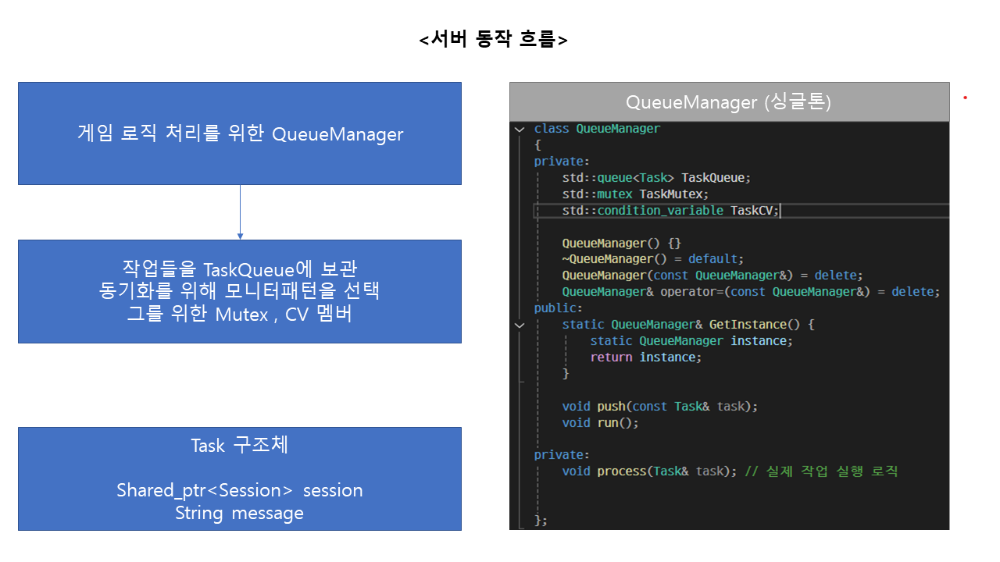
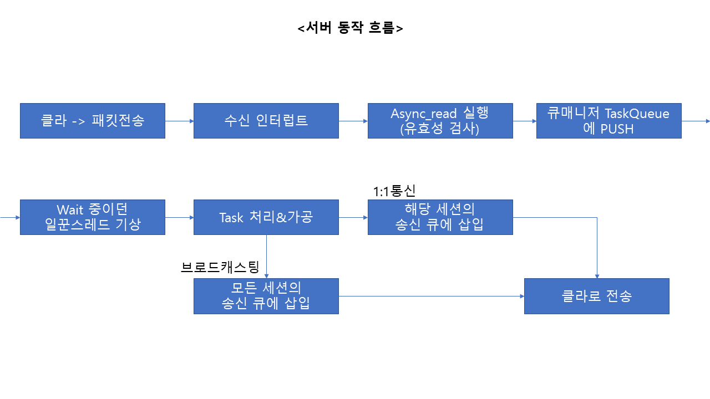

# C++ Asio(NoneBoost) 비동기 , 쓰레드 풀 활용한 서버 설계 및 구현

## 목표
- 비동기 네트워킹에 대한 깊은 이해
- 스레드풀 구조에 대한 이해와 구축 경험
- 대규모 트래픽을 염두하여 대응할 수 있는 서버 설계 및 구축

## 진행상황

### 다음 회차 목표

---

### 3회차 , 비동기 송.수신 구현 , 로직&네트워킹 스레드 분리

- 수신은 쉬웠다.. 비동기 송신을 할 때 하나를 놓쳐서 몇시간 고생했다.
    - 동기 방식과는 다르게 비동기 송신은 콜백함수를 등록하게 되는데, 이 때 보낼 패킷을 사라지지않게 처리를 하지않고 지역변수 등으로 사용하게된다면 런타임 에러 지옥을 맛보게 된다.
    - 실제로 자료형을 그냥 string& 레퍼런스를 사용했는데, 레퍼런스 생성한 곳 조차 함수 지역 스코프 안이라서 함수 종료시 사라져버리는 문제가 발생, 이유도 모르고 이상한 부분 계속 건드리다가 해답을 찾음
    - shared_ptr 을 사용하여 string 을 감싸주고 소멸하지않게 관리하여 해결!

문제의 string이 생성되는 곳..

- 큐매니저 구현으로 로직처리와 네트워킹 업무를 분리해 주었다.
    
        

---

### 2회차 , Asio가 제공하는 async_send 메서드 활용하여 메시지 송신 해보기

- write 와 달리 send는 네트워크 혼잡도 , 버퍼 꽉참 등으로 인해 데이터가 잘려서 보내질 수 있어 유의해서 다루어야한다.
- send + queue 조합을 통해 안전성과, 자유도를 획득할 수 있다.
- 고성능 서버로 갈 수록 익혀놓아야 할 스킬인 것 같다.

---

### 1회차 , 스레드 풀 기초구조 설계 

- 비동기 Acceptor 기능 구현으로 클라이언트와 연결 테스트

- 초기 설계
    - 키워드 : 비동기 네트워킹 , 네트워크 | 로직 스레드 분리 , 스레드 풀 활용

---

---

---

---

---

