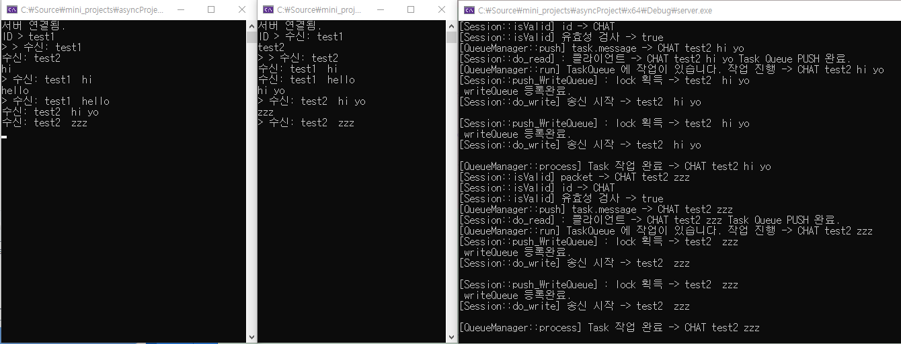
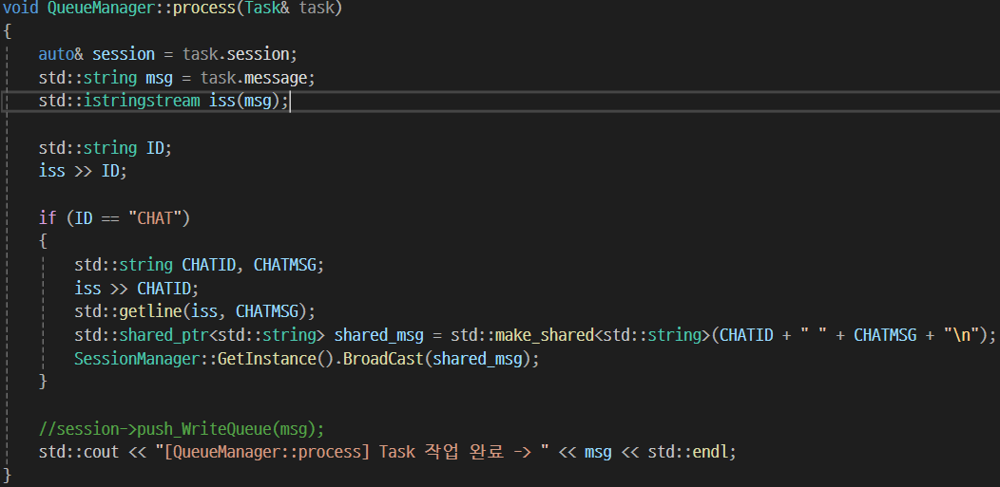

# C++ Asio(NoneBoost) 비동기 , 쓰레드 풀 활용한 서버 설계 및 구현

## 목표
- 비동기 네트워킹에 대한 깊은 이해
- 스레드풀 구조에 대한 이해와 구축 경험
- 대규모 트래픽을 염두하여 대응할 수 있는 서버 설계 및 구축

## 진행상황

### 다음 회차 목표

- 클라이언트도 비동기로 구현
- 대규모 트래픽이 들어오는 테스트 환경 구상하기
- 오류 찾기 , 수정

---

### 3회차 , 비동기 송.수신 구현 , 로직&네트워킹 스레드 분리

- 머리가 터질거같은 관계로 테스트용 클라이언트를 빠르게 구현(동기방식 & 쓰레드수신) 후 테스트결과



급조된 클라이언트인 관계로 입력받는곳이 어수선하다. 그래도 송,수신과 브로드캐스팅이 잘 작동하는 모습

---

- 수신은 쉬웠다.. 비동기 송신을 할 때 하나를 놓쳐서 몇시간 고생했다.
    - 동기 방식과는 다르게 비동기 송신은 콜백함수를 등록하게 되는데, 이 때 보낼 패킷을 사라지지않게 처리를 하지않고 지역변수 등으로 사용하게된다면 런타임 에러 지옥을 맛보게 된다. (why? 지역변수는 스택이 해제되면 소멸하는데, 없는녀석을 찾아서 송신하려고하니 ...)
    - 자료형을 그냥 string& 레퍼런스를 사용했어서 더 오류를 못잡았던것도 있다, 레퍼런스 생성한 곳 조차 함수 지역 스코프 안이라서 함수 종료시 사라져버리는 문제가 발생하는데, 그걸 인지하지 못한 채 이상한 부분 계속 건드리다가 해답을 찾음
    - 여러 해결방법이 있겠지만 나는 shared_ptr 을 사용하여 string 을 감싸주고 소멸하지않게 관리하여 해결하였다.


아래는 문제의 string이 생성되는 곳.. 기존 std::string& msg -> std::shared_ptr<std::string> shared_msg 로 변경,
레퍼런스 타입이라 괜찮겠지.. 했다가 호되게 당해버림


- 큐매니저 구현으로 로직처리와 네트워킹 업무를 분리해 주었다.
    - Asio가 제공하는 io_context 에는 비동기 네트워킹 작업만 등록
    - 서버가 처리해야할 다른 로직들은 큐매니저(싱글톤)에 등록 후 처리하게끔 구현했다.

```txt
-> 패킷 도착(인터럽트 발생) 
-> io_context 내 등록된 read 함수 실행 
-> 큐매니저의 Task Queue에 푸쉬
**모니터 패턴**
-> Task Queue에 데이터 생성됨 
-> 일거리를 찾기위해 wait중인 워커스레드에게 signal 전송 
-> 워커스레드 중 하나가 일어남
-> (아무도 lock을 안가지고있다면) 
-> lock 획득 후 Task Queue.pop() 
-> Task 처리&패킷가공 
-> Session 클래스에 있는 송신큐에 푸쉬
-> 준비된 메서드 실행으로 송신큐 체크하라고 신호 보냄 
-> write 함수 실행 [전송중에 또 실행되지 않기 위해 flag 변수 활용]
```

- 이론으로만 들었던 mutex , 모니터를 직접 구현해보며 **데드락**을 피하기위해 mutex lock을 들고 또 lock을 취득하려는 모습을 최대한 구현하지 않으려 노력했다.

- 패킷 도착 후 파싱 -> 로직 처리 구현 (일단은 테스트용 CHAT 기능만 구현)
    - 특징 : 채팅 메시지는 공백을 포함하여 한번에 수용하기위해 getline을 사용.
        


---

### 2회차 , Asio가 제공하는 async_send 메서드 활용하여 메시지 송신 해보기

- write 와 달리 send는 네트워크 혼잡도 , 버퍼 꽉참 등으로 인해 데이터가 잘려서 보내질 수 있어 유의해서 다루어야한다.
- send + queue 조합을 통해 안전성과, 자유도를 획득할 수 있다.
- 고성능 서버로 갈 수록 익혀놓아야 할 스킬인 것 같다.


---

### 1회차 , 스레드 풀 기초구조 설계 

- 비동기 Acceptor 기능 구현으로 클라이언트와 연결 테스트


- 초기 설계
    - 키워드 : 비동기 네트워킹 , 네트워크 | 로직 스레드 분리 , 스레드 풀 활용


---


---


---


---


---

